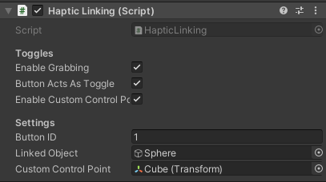
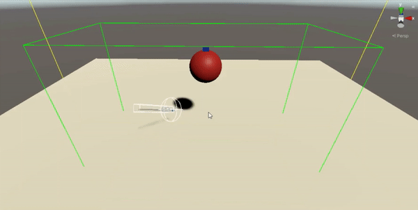

# OpenHapticsLinking
A script to allow for linking the haptics to a desired object in order to "control" it.

Works together with the [OpenHaptics Plugin](https://assetstore.unity.com/packages/tools/integration/3d-systems-openhaptics-unity-plugin-134024?aid=1100l355n&gclid=CjwKCAiAl4WABhAJEiwATUnEF7IUXMF8TnhE7W34YyxzB8wptsCXRr9AIXlPCgFvgm2ZjjSxJzwVnhoCEd0QAvD_BwE&pubref=UnityAssets%2ADyn03%2A1723478829%2A67594162255%2A336302044055%2Ag%2A%2A%2Ab%2Ac%2Agclid%3DCjwKCAiAl4WABhAJEiwATUnEF7IUXMF8TnhE7W34YyxzB8wptsCXRr9AIXlPCgFvgm2ZjjSxJzwVnhoCEd0QAvD_BwE&utm_source=aff)

To use this script:
- Import the OpenHaptics Plugin,
- Drag in the Haptic Device with Grabber Prefab
- On the gameobject called *Grabber* remove the haptic grabber component & add the hapticLinking script from this repo.

Settings:

Video Demonstration:

